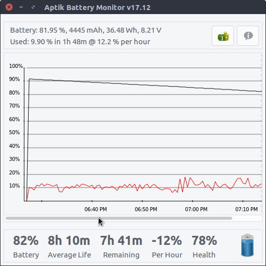
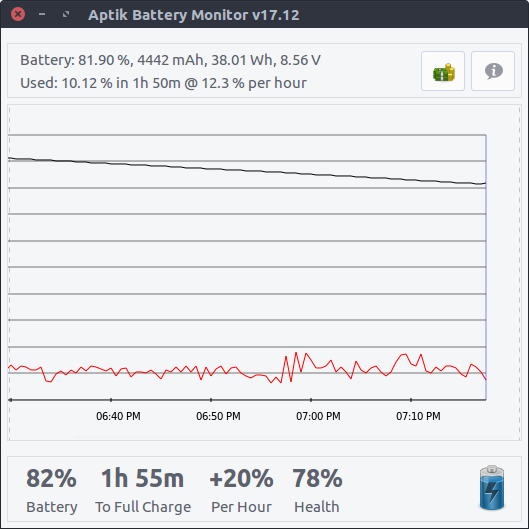

# Battery Monitor

Battery Monitor is a utility to monitor the battery life of laptops. It displays a graph of the change in battery level with time. This is useful to estimate the amount of battery life that you are getting from your laptop, and to check the overall health.

**Average Life** is the amount of time your laptop takes to go from 100% to 0%. It takes a few charge-discharge cycles to get an accurate estimate of this value.

**Health** is the remaining life of battery. It is normally 100% when the battery is new, and slowly degrades with time.  For example, a two-year old laptop may show health of 80%, which indicates that only 80% of the original capacity is left.

*Discharging - Displays average life, time remaining and discharge rate*




**Black line** in the graph displays battery level at a particular time.

**Red line** in the graph displays CPU usage. CPU usage is usually high if battery is discharging rapidly.

*Charging - Displays charge rate and time remaining*



## Installation

#### Ubuntu-based Distributions

Ubuntu, Linux Mint, Elementary OS, etc.

Packages are available in the Launchpad PPA for current Ubuntu releases.
Run following commands in a terminal window to install from PPA:

```sh
sudo add-apt-repository -y ppa:teejee2008/ppa
sudo apt-get update
sudo apt-get install aptik-battery-monitor
```

Debian packages are available on the [Releases](https://github.com/teejee2008/battery-monitor/releases) page for older Ubuntu releases which have reached end-of-life.

#### Other Linux Distributions

Binary installers are available on the [Releases](https://github.com/teejee2008/battery-monitor/releases) page. Download the 32-bit or 64-bit installer and execute from terminal window:

```sh
sudo sh ./aptik-battery-monitor*amd64.run # 64-bit, or
sudo sh ./aptik-battery-monitor*i386.run  # 32-bit
```

Installer can be used on following distribution types:

- **Fedora** based - Fedora, RedHat, Cent OS, etc (supports **dnf** and **yum**)

- **Debian** based - Debian, Ubuntu, Linux Mint, Elementary OS, etc (supports **apt**)

- **Arch** based - Arch Linux, Manjaro, etc (supports **pacman**)

  ​

## Donate

*Battery Monitor* is a non-commercial application. I work on it during my free time based on my requirements and interest.

**PayPal** ~ If you find this application useful and wish to say thanks, you can buy me a coffee by making a donation with Paypal. Your contributions will help keep the project alive and support future development.

[](https://www.paypal.com/cgi-bin/webscr?business=teejeetech@gmail.com&cmd=_xclick&currency_code=USD&amount=10&item_name=BatteryMonitor%20Donation)  

**Patreon** ~ You can also sign up as a sponsor on [Patreon.com](https://www.patreon.com/teejeetech). As a patron you will get access to beta releases of new applications that I'm working on. You will also get news and updates about new features that are not published elsewhere.

[](https://www.patreon.com/bePatron?u=3059450)

